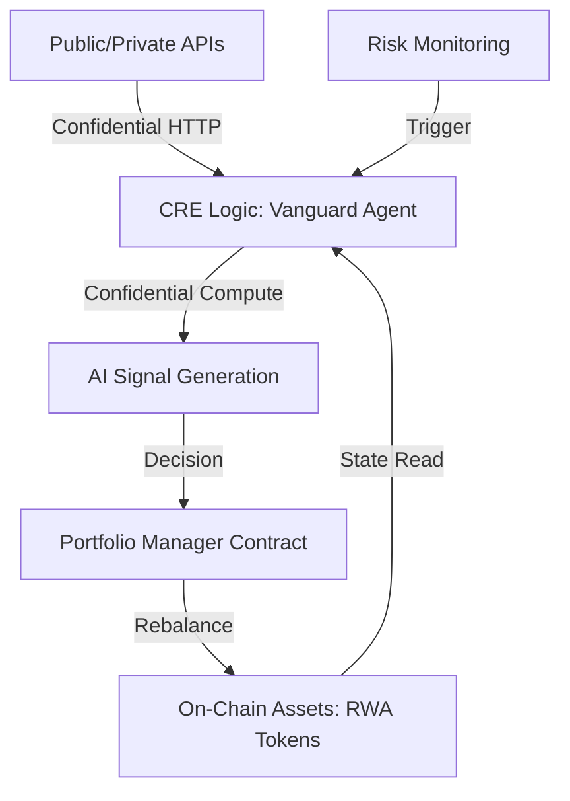

# 🛡️ Vanguard: Privacy-Preserving RWA Portfolio Guardian

Vanguard is an **autonomous, privacy-preserving portfolio manager** built for institutions and private funds managing Real-World Assets (RWAs). It sits as an orchestration layer within the **Chainlink Runtime Environment (CRE)**, enabling sophisticated investment strategies that remain fully private and resistant to front-running.

## 🌟 Project Vision

For institutional DeFi to scale, privacy is non-negotiable. Vanguard solves the "Transparency vs. Competitive Advantage" trade-off by running proprietary AI/Logic off-chain in a verifiable environment.

## 🚀 Key Features

*   **Confidential Strategy Execution**: Proprietary trading signals and logic execute within the CRE, ensuring that your unique alpha is never exposed on a public ledger.
*   **Secure Institutional Feeds**: Uses **Confidential HTTP** to fetch data from private NAV feeds and institutional APIs (e.g., Bloomberg) without exposing credentials or sensitive response data.
*   **Autonomous Risk Management**: Real-time monitoring of collateral ratios and market volatility. Upon detecting a "black swan" event, the Vanguard Guardian automatically rebalances funds into a "Flight to Quality" asset.
*   **Verifiable Settlement**: While the logic is private, the final settlement is executed on-chain and verified via the CRE's consensus mechanism.

## 🛠️ Tech Stack

- **Workflow Orchestration**: Chainlink Runtime Environment (CRE)
- **Language**: TypeScript (CRE SDK)
- **Security**: Confidential Compute & Confidential HTTP
- **Simulations**: Tenderly Virtual Testnets
- **Blockchain**: Ethereum / Arbitrum (Mock RWA ERC1155)

## 📊 High-Level Architecture



## 🏗️ Getting Started

### Prerequisites

- [CRE CLI](https://docs.chain.link/cre/getting-started/installing-the-cre-cli-macos-linux)
- [Bun Runtime](https://bun.sh/)
- Node.js & NPM

### Functional Simulation (Local Testing)

To see the Vanguard Guardian in action without deploying to a live blockchain, you can use the built-in mock API:

1.  **Start the Mock Institutional API**:
    ```bash
    node mock_api.js
    ```
2.  **Run the CRE Workflow Simulation**:
    ```bash
    cd asset-log-trigger-workflow
    cre workflow simulate
    ```

The Guardian will fetch data from the local server. If you want to force a "Black Swan" event to see the rebalancing transaction:
```bash
curl "http://localhost:8080/?status=black_swan"
```

## 🗺️ Roadmap

- [x] **Phase 1: Foundation** - Base CRE project setup and RWA contracts.
- [ ] **Phase 2: Logic Integration** - Full implementation of AI-driven risk triggers.
- [ ] **Phase 3: Privacy Layer** - Integration of Confidential Compute for secret management.
- [ ] **Phase 4: Dashboard** - A real-time institutional monitor for rebalancing events.

---

Built for the **Chainlink Constellation Hackathon**.
