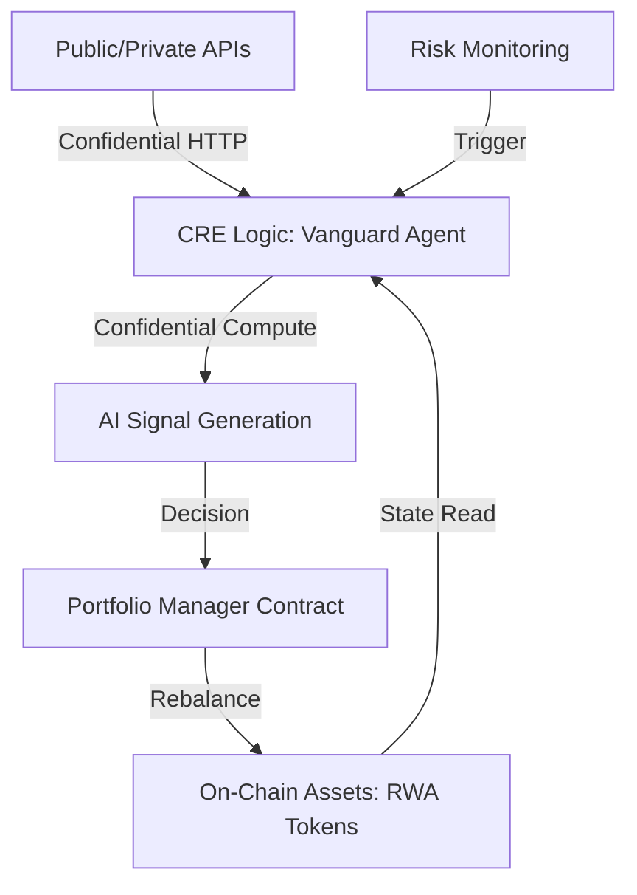

# Vanguard: Privacy-Preserving RWA Portfolio Guardian

Vanguard is a professional, autonomous, and privacy-preserving portfolio management system designed for institutional investors and private funds managing Real-World Assets (RWAs). Built on top of the Chainlink Runtime Environment (CRE), it provides an orchestration layer that enables the execution of sophisticated investment strategies while maintaining full logic and signal privacy.

## Overview

In traditional finance, proprietary trading strategies and risk management protocols are sensitive intellectual property. Vanguard allows these strategies to be moved on-chain without exposing them to public ledgers or front-running bots, by leveraging Confidential Compute and the Chainlink Runtime Environment.

## Project Vision

Institutional adoption of decentralized finance requires robust privacy controls. Vanguard addresses the inherent trade-off between blockchain transparency and competitive advantage by executing proprietary logic in a verifiable, off-chain environment.

## Core Capabilities

*   **Confidential Strategy Execution**: Proprietary trading signals and rebalancing logic execute within the CRE, ensuring that investment alpha is protected from public exposure.
*   **Human-in-the-Loop Governance**: Integration with World ID enables secure, privacy-preserving governance. Critical rebalances can be configured to require verifiable humanness confirmation within the CRE before final execution.
*   **Secure Institutional Feeds**: Leveraging Confidential HTTP, Vanguard securely fetches market data from private institutional APIs (such as Bloomberg or Refinitiv) without exposing API credentials or sensitive response data on the blockchain.
*   **Autonomous Risk Management**: Real-time monitoring of collateral ratios and market volatility. The Vanguard Guardian automatically triggers risk mitigation strategies—such as moving to high-quality liquid assets—upon detecting specified risk thresholds or "black swan" events.
*   **Verifiable On-Chain Settlement**: While the execution logic remains private, final investment decisions are settled on-chain and verified via the CRE consensus mechanism.

## Tech Stack

*   **Orchestration**: Chainlink Runtime Environment (CRE)
*   **Language**: TypeScript (CRE SDK)
*   **Identity & Governance**: World ID
*   **Security**: Confidential Compute & Confidential HTTP
*   **Smart Contracts**: Solidity (ERC1155 Portfolio Monitoring)
*   **Frontend**: React (Institutional Portfolio Dashboard)
*   **Testing**: Tenderly Virtual Testnets & Bun Runtime

## Institutional Dashboard

Vanguard includes a high-performance React-based monitoring suite that provides fund managers with a real-time view of portfolio health, market risk scores, and Guardian activity logs. The dashboard includes a simulation control center to test the system's response to various market conditions.

## High-Level Architecture



## Getting Started

### Prerequisites

*   CRE CLI
*   Bun Runtime
*   Node.js & NPM

### Functional Simulation

Vanguard includes a local testing environment to simulate institutional data feeds and Guardian responses.

1.  **Initialize the Mock API**:
    ```bash
    npm run api
    ```

2.  **Launch the Dashboard**:
    ```bash
    npm run dashboard
    ```

3.  **Run the CRE Simulation**:
    ```bash
    npm run simulate
    ```

4.  **Simulate a Market Event**:
    Use the simulation controls on the dashboard or use the provided script to trigger market volatility:
    ```bash
    ./test-trigger.sh
    ```

## Roadmap

*   **Phase 1: Foundation (Current)**: Initialized CRE architecture, RWA smart contracts, and the Vanguard Guardian logic.
*   **Phase 2: Institutional Suite (Current)**: Developed the real-time monitoring dashboard and the mock institutional data layer.
*   **Phase 3: Governance (Current)**: Integrated World ID for human-in-the-loop verification on critical rebalance events.
*   **Phase 4: Privacy & CCIP (Future)**: Implementing full Confidential Compute handlers and multi-chain rebalancing via Chainlink CCIP.

---

Vanguard: Empowering Institutions with Verifiable, Private, and Autonomous RWA Management.
Built for the Chainlink Constellation Hackathon.
